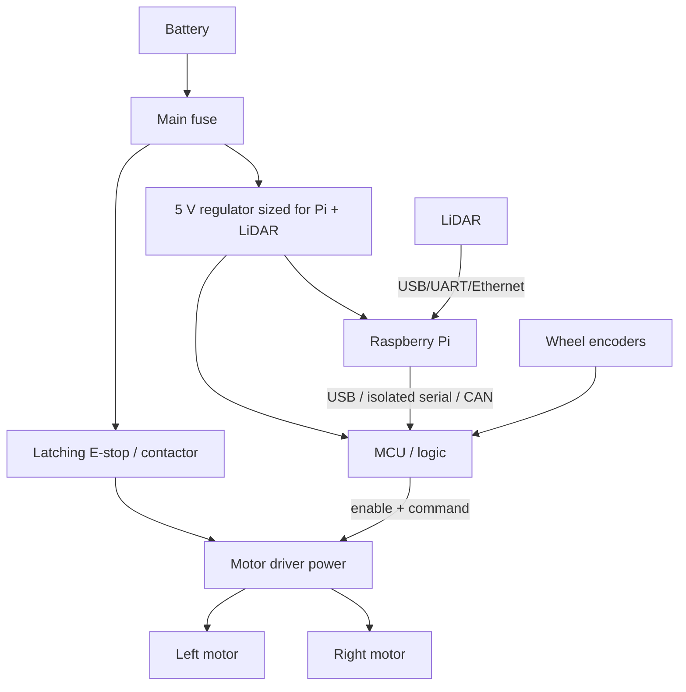

---
tags:
  - robotics
  - hardware
  - raspberry-pi
  - lidar
  - safety
date: 2026-08-18
---

# 01 — Hardware Architecture and Wiring

Back to [[Physical Robot Deployment - Start Here]] · Next: [[02 Raspberry Pi and ROS 2 Setup]]

## Separate high-level autonomy from motor control

Use the Raspberry Pi for ROS 2, LiDAR processing, transforms, inference, and logging. Use a microcontroller or a smart
motor controller for:

- quadrature encoder counting;
- left/right wheel-speed PID at roughly 100–500 Hz;
- motor PWM/direction or current commands;
- a communication watchdog;
- hardware fault reporting;
- immediate zero output when disabled.

The Pi sends left/right velocity targets or a body twist. The controller returns wheel position and velocity. A custom
`ros2_control` hardware component bridges this protocol. The official `ros2_control`
[hardware-component guide](https://control.ros.org/jazzy/doc/ros2_control/hardware_interface/doc/hardware_components_userdoc.html)
describes the `read()`/`write()` and lifecycle boundary.

> [!warning] Avoid direct open-loop PWM from the policy
> Open-loop motor PWM varies with battery voltage, floor, payload, and motor temperature. It also provides poor
> odometry. The learned actor expects measured velocity and benefits from repeatable closed-loop wheel response.

## Hardware blocks

| Block | Requirement |
|---|---|
| Raspberry Pi | Pi 5 recommended; active cooler; 64-bit; no undervoltage under motor transients |
| LiDAR | 360° planar scan, useful range beyond 8 m optional, driver publishes `LaserScan`, scan rate preferably ≥20 Hz |
| Motors | Gearmotors with quadrature encoders |
| Motor driver | Rated above battery voltage and **motor stall current**; logic compatible with controller |
| Low-level controller | MCU or smart driver with encoder feedback and stale-command stop |
| Power | Fused motor rail plus regulated Pi rail; adequate wire gauge and connectors |
| Safety | Latching E-stop, motor-enable cut, accessible remote stop, optional bumper |
| Optional IMU | Gyroscope with a maintained ROS 2 driver for better yaw-rate/odometry fusion |

Choose the LiDAR based on driver support for ROS 2 Jazzy and ARM64, not only price or advertised range. Confirm the
driver produces correct timestamps, `angle_min`, `angle_increment`, `range_min`, and `range_max`. A 10 Hz scanner can
work, but the 20 Hz policy then sees each scan twice; measure and later reproduce this staleness in training.

## Power tree



The exact topology depends on the motor driver, but preserve these properties:

1. The E-stop removes motor torque even if the Pi and MCU are frozen.
2. The Pi has a stable regulated supply; do not power it from a noisy, undersized motor-controller logic output.
3. Grounds are referenced correctly for non-isolated signals, with no high-current motor return through logic wiring.
4. Every battery branch is fused for its wire and load.
5. USB and encoder cables are secured and separated from motor leads where practical.
6. Motor suppression and wiring follow the motor-driver manufacturer's guidance.

Electrical design, battery protection, fusing, and stall-current sizing must be reviewed for the actual components.

## Mechanical conventions

Use ROS REP-style body axes throughout:

```text
+X forward
+Y left
+Z up
positive yaw counterclockwise when viewed from above
```

Define `base_link` near the projected center of rotation. Define wheel joints in `[left, right]` order. Mount the
LiDAR level, rigid, above the chassis, with its zero-angle mark facing +X.

The simulation contract used this nominal LiDAR pose:

```text
lidar relative to base: x=+0.08 m, y=0.00 m, z=+0.215 m, yaw=0
```

Matching that pose is the easiest transfer. If the physical mount differs significantly, either retrain with the new
pose or transform scan points to the trained virtual sensor frame and validate the resulting ranges. Merely changing
the TF does not change the ranges already measured from the physical LiDAR origin.

## Encoder and wheel units

The hardware interface should expose:

```text
left_wheel_joint/position   radians
right_wheel_joint/position  radians
left_wheel_joint/velocity   radians/second
right_wheel_joint/velocity  radians/second
```

If the encoder gives `C` quadrature counts per motor revolution and gearbox ratio `G` motor turns per wheel turn:

```text
counts_per_wheel_revolution = C * G
wheel_angle_rad = 2*pi * accumulated_counts / counts_per_wheel_revolution
```

Check whether the encoder specification already includes x2/x4 quadrature decoding and whether the quoted gear ratio
is exact. Preserve accumulated position across normal controller reads; do not wrap it to one revolution.

## MCU protocol minimum

A small binary or framed text protocol should include:

### Pi to controller

- sequence number;
- left/right target in rad/s;
- enable flag;
- checksum/CRC;
- regular heartbeat.

### Controller to Pi

- matching or latest sequence number;
- accumulated encoder counts or wheel angles;
- measured wheel velocities;
- controller timestamp;
- battery voltage if available;
- watchdog, overcurrent, encoder, and driver fault flags.

Recommended failure behavior:

- malformed frame: ignore it;
- no valid command for 100–200 ms: ramp or immediately command zero according to measured safe behavior;
- driver/encoder fault: disable both motors and latch a fault;
- Pi reconnect: remain disabled until an explicit enable transition.

Do not let one stale wheel command remain active when the other side faults.

## Bench acceptance checklist

Keep the wheels off the ground and cap target speed before continuing:

- [ ] E-stop disables the motor outputs while the Pi continues logging.
- [ ] Disconnecting Pi–MCU communication stops both wheels within the watchdog time.
- [ ] Reconnecting does not unexpectedly restart motion.
- [ ] Positive left and right targets rotate both wheels in the physical forward direction.
- [ ] Reported encoder signs match commanded wheel signs.
- [ ] One physical wheel revolution reports approximately `2π` radians.
- [ ] Encoder position remains stable when a wheel is held still.
- [ ] Motor and driver temperature remain acceptable in a restrained low-speed test.
- [ ] Pi reports no undervoltage or reboot during starts, stops, and direction changes.

Only after this passes should ROS body-velocity control be enabled. Continue with
[[03 ROS 2 Base, Odometry, and TF]].

