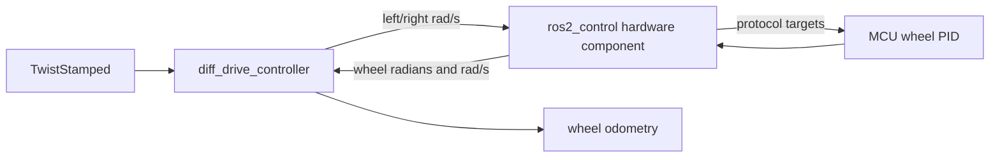

---
tags:
  - robotics
  - ros2
  - ros2-control
  - odometry
  - tf2
date: 2026-08-18
---

# 03 — ROS 2 Base, Odometry, and TF

Previous: [[02 Raspberry Pi and ROS 2 Setup]] · Back to [[Physical Robot Deployment - Start Here]] · Next:
[[04 LiDAR and the 79-Value Contract]]

Get body-velocity control, encoder odometry, and transforms correct **before** starting the neural policy. A
teleoperated robot with incorrect signs or scale will remain incorrect under RL.

## Control ownership



The `diff_drive_controller` accepts body velocity, converts it to wheel velocity, consumes encoder feedback, and
publishes odometry. Its Jazzy interface is documented at
[diff_drive_controller](https://control.ros.org/jazzy/doc/ros2_controllers/diff_drive_controller/doc/userdoc.html).

## Robot description and hardware component

The robot URDF/Xacro must define `base_link`, both driven wheel joints, `lidar_link`, inertial/collision geometry, and
the `ros2_control` hardware block. A minimal hardware block is:

```xml
<ros2_control name="NavbotSystem" type="system">
  <hardware>
    <plugin>navbot_hardware/NavbotSystem</plugin>
    <param name="device">/dev/ttyACM0</param>
    <param name="baud_rate">921600</param>
    <param name="command_timeout_ms">150</param>
  </hardware>

  <joint name="left_wheel_joint">
    <command_interface name="velocity"/>
    <state_interface name="position"/>
    <state_interface name="velocity"/>
  </joint>

  <joint name="right_wheel_joint">
    <command_interface name="velocity"/>
    <state_interface name="position"/>
    <state_interface name="velocity"/>
  </joint>
</ros2_control>
```

Replace the plugin and protocol parameters with the actual hardware. The component's `read()` obtains accumulated
wheel angle and measured wheel velocity; `write()` sends velocity targets. On deactivate, error, shutdown, or stale
communication, it must command zero/disable. Follow the official
[writing a hardware component](https://control.ros.org/jazzy/doc/ros2_control/hardware_interface/doc/writing_new_hardware_component.html)
guide and add communication-independent unit tests.

Add the fixed LiDAR transform using measured mount dimensions:

```xml
<joint name="base_to_lidar" type="fixed">
  <parent link="base_link"/>
  <child link="lidar_link"/>
  <origin xyz="0.08 0.0 0.215" rpy="0 0 0"/>
</joint>
```

## Controller configuration

Start with measured nominal geometry. The values below match the training robot and must be replaced if the physical
robot differs:

```yaml
controller_manager:
  ros__parameters:
    update_rate: 100

    joint_state_broadcaster:
      type: joint_state_broadcaster/JointStateBroadcaster

    diff_drive_controller:
      type: diff_drive_controller/DiffDriveController

diff_drive_controller:
  ros__parameters:
    left_wheel_names: [left_wheel_joint]
    right_wheel_names: [right_wheel_joint]

    wheel_radius: 0.055
    wheel_separation: 0.335
    wheel_separation_multiplier: 1.0
    left_wheel_radius_multiplier: 1.0
    right_wheel_radius_multiplier: 1.0

    position_feedback: true
    open_loop: false
    odom_frame_id: odom
    base_frame_id: base_link
    enable_odom_tf: true
    publish_rate: 50.0
    publish_limited_velocity: true
    velocity_rolling_window_size: 10
    cmd_vel_timeout: 0.25

    linear.x.max_velocity: 0.8
    linear.x.min_velocity: 0.0
    linear.x.max_acceleration: 1.5
    linear.x.max_deceleration: -1.5

    angular.z.max_velocity: 1.5
    angular.z.min_velocity: -1.5
    angular.z.max_acceleration: 3.0
    angular.z.max_deceleration: -3.0

    pose_covariance_diagonal: [0.01, 0.01, 1000000.0, 1000000.0, 1000000.0, 0.03]
    twist_covariance_diagonal: [0.02, 0.02, 1000000.0, 1000000.0, 1000000.0, 0.05]
```

These limit values reproduce the trained 0.8 m/s, 1.5 rad/s, 1.5 m/s², and 3 rad/s² envelope. Begin physical tests
with lower maximums, such as 0.15 m/s and 0.4 rad/s. Increase them only after the staged validation passes.

> [!important] Use encoder feedback
> `open_loop: false` makes odometry use state feedback. Open-loop odometry uses commanded velocity and is unsuitable
> as the policy's measured-velocity observation.

## TF ownership

There must be exactly one publisher for each dynamic transform:

| Transform | Initial producer | Later producer |
|---|---|---|
| `base_link -> lidar_link` | `robot_state_publisher` from fixed URDF | same |
| `odom -> base_link` | `diff_drive_controller` | `robot_localization` EKF if enabled |
| `map -> odom` | absent for odom-frame goals | SLAM Toolbox or AMCL/localizer |

When adding an IMU/EKF:

1. set `diff_drive_controller.enable_odom_tf: false`;
2. keep publishing wheel odometry as `/wheel/odom`;
3. fuse `/wheel/odom` and `/imu/data` with `robot_localization` in `two_d_mode`;
4. let the EKF publish `odom -> base_link` and `/odometry/filtered`;
5. point the policy velocity input at `/odometry/filtered`.

Never let both the drive controller and EKF publish `odom -> base_link`.

## Bring up without the policy

With the wheels raised and E-stop available:

```bash
ros2 launch navbot_bringup base.launch.py

ros2 control list_hardware_components
ros2 control list_hardware_interfaces
ros2 control list_controllers
ros2 topic hz /joint_states
ros2 topic hz /diff_drive_controller/odom
```

The velocity command for Jazzy is stamped:

```bash
ros2 topic pub --rate 10 /diff_drive_controller/cmd_vel \
  geometry_msgs/msg/TwistStamped \
  "{header: {frame_id: base_link}, twist: {linear: {x: 0.05}, angular: {z: 0.0}}}"
```

Stop the publisher with Ctrl+C and verify the controller and MCU timeouts stop both wheels. Repeat with `angular.z:
0.2` at very low speed.

## Ground calibration sequence

1. Mark tire contact points and measure loaded wheel radius.
2. Measure center-to-center wheel separation as a starting value.
3. Command 1–2 m straight at low speed; compare tape-measured distance with odometry.
4. Command several slow full rotations; compare an external yaw reference with odometry.
5. Tune wheel-radius and separation multipliers, not the policy output.
6. Repeat in both directions and with representative payload.
7. Measure step response, stopping distance, left/right bias, and command latency for later simulation randomization.

## Inspection commands

```bash
ros2 run tf2_tools view_frames
ros2 run tf2_ros tf2_echo odom base_link
ros2 run tf2_ros tf2_echo base_link lidar_link
ros2 topic echo /diff_drive_controller/odom --once
ros2 topic echo /joint_states --once
```

Acceptance criteria before policy work:

- [ ] Straight command produces +X odometry with minimal yaw drift.
- [ ] Positive yaw command produces counterclockwise motion and positive `angular.z`.
- [ ] Wheel positions are continuous radians with correct signs.
- [ ] Measured velocity falls to zero when the robot stops.
- [ ] TF has no repeated-data warnings, loops, or duplicate odom publishers.
- [ ] Controller timeout and MCU watchdog have both been tested by interruption.

