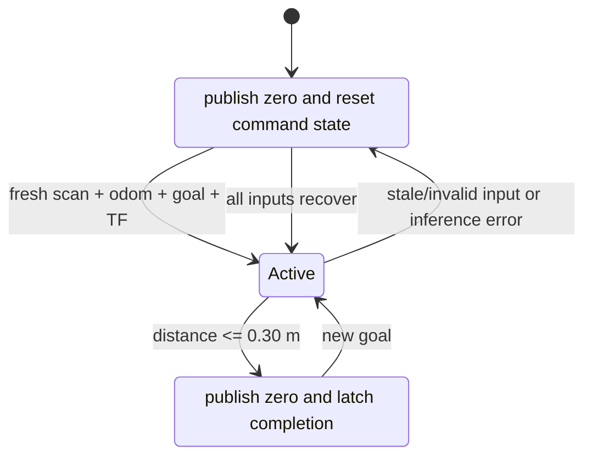

---
tags:
  - robotics
  - ros2
  - onnx
  - reinforcement-learning
  - deployment
date: 2026-08-18
---

# 05 — ONNX Policy Node

Previous: [[04 LiDAR and the 79-Value Contract]] · Back to [[Physical Robot Deployment - Start Here]] · Next:
[[06 Safety, Bringup, and Operations]]

The policy node is a local navigator, not a motor driver. It synchronizes the newest sensor state, constructs the
contract tensor, runs ONNX inference at 20 Hz, applies the same command mapping and acceleration envelope as
simulation, and publishes a **proposed** `TwistStamped` to the safety layer.

## Inputs and output

| Interface | Default | Rule |
|---|---|---|
| LiDAR | `/scan` | latest `LaserScan`, sensor-data QoS, maximum age 0.20 s |
| Odometry | `/odometry/filtered` or `/diff_drive_controller/odom` | measured twist, maximum age 0.15 s |
| Goal | `/goal_pose` | `PoseStamped` in `map` or `odom`; transformed with current TF |
| Proposed command | `/policy/cmd_vel` | `TwistStamped`, 20 Hz |
| Diagnostics | `/diagnostics` and logs | inference time, ages, stop reason, goal distance, action |

## Node state machine



Publishing zero once is insufficient. Continue publishing a zero command while inactive so downstream watchdogs and
tools have an unambiguous state.

## ONNX session

This actor is small, so CPU inference is appropriate. Warm it up and benchmark on the Pi rather than assuming a
deadline:

```python
import numpy as np
import onnxruntime as ort

options = ort.SessionOptions()
options.execution_mode = ort.ExecutionMode.ORT_SEQUENTIAL
options.graph_optimization_level = ort.GraphOptimizationLevel.ORT_ENABLE_ALL
options.intra_op_num_threads = 1  # benchmark 1, 2, and default on the actual Pi

session = ort.InferenceSession(
    "/home/ubuntu/robot_ws/model/policy.onnx",
    sess_options=options,
    providers=["CPUExecutionProvider"],
)
input_name = session.get_inputs()[0].name

dummy = np.zeros((1, 79), dtype=np.float32)
for _ in range(20):
    session.run(None, {input_name: dummy})
```

ONNX Runtime documents thread behavior at
[Thread management](https://onnxruntime.ai/docs/performance/tune-performance/threading.html). More threads are not
automatically faster for this small MLP. Record median, p95, and worst-case inference time while LiDAR, TF, logging,
and motor control are also running. The complete tick must remain comfortably below 50 ms.

## Core control tick

The following is the required logic. Keep scan packing in a separately unit-tested module as described in
[[04 LiDAR and the 79-Value Contract]].

```python
CONTROL_DT = 0.05
GOAL_TOLERANCE_M = 0.30
MAX_LINEAR_MPS = 0.8
MAX_ANGULAR_RPS = 1.5
MAX_LINEAR_ACCEL = 1.5
MAX_ANGULAR_ACCEL = 3.0


def policy_tick(self):
    if not self.inputs_are_fresh_and_valid():
        self.reset_policy_state()
        self.publish_stop("missing_or_stale_input")
        return

    try:
        scan72 = scan_to_policy_bins(self.latest_scan)
        goal_x, goal_y = self.current_goal_in_base_link()  # latest TF, not old goal timestamp
        distance = math.hypot(goal_x, goal_y)
        bearing = math.atan2(goal_y, goal_x)

        if distance <= GOAL_TOLERANCE_M:
            self.reset_policy_state()
            self.publish_stop("goal_reached")
            return

        goal3 = np.array(
            [min(distance, 8.0) / 8.0, math.sin(bearing), math.cos(bearing)],
            dtype=np.float32,
        )
        velocity2 = np.array(
            [self.latest_odom.twist.twist.linear.x / MAX_LINEAR_MPS,
             self.latest_odom.twist.twist.angular.z / MAX_ANGULAR_RPS],
            dtype=np.float32,
        )
        velocity2 = np.clip(velocity2, -2.0, 2.0)

        obs = pack_observation(scan72, goal3, velocity2, self.previous_action)
        output = self.session.run(None, {self.input_name: obs[None, :]})[0]
        action = np.asarray(output, dtype=np.float32).reshape(-1, 2)[0]
        if not np.all(np.isfinite(action)):
            raise ValueError("non-finite policy output")
        action = np.clip(action, -1.0, 1.0)

        target_v = 0.4 * (float(action[0]) + 1.0)
        target_w = 1.5 * float(action[1])
        command_v = move_toward(
            self.applied_v, target_v, MAX_LINEAR_ACCEL * CONTROL_DT
        )
        command_w = move_toward(
            self.applied_w, target_w, MAX_ANGULAR_ACCEL * CONTROL_DT
        )

        self.previous_action[:] = action       # raw normalized actor output
        self.applied_v = command_v             # state after acceleration limiting
        self.applied_w = command_w
        self.publish_proposed_twist(command_v, command_w)
    except Exception as error:
        self.reset_policy_state()
        self.publish_stop(f"policy_error: {error}")
```

`move_toward(current, target, max_delta)` clamps `target-current` to `[-max_delta, +max_delta]`. Use actual elapsed
steady-clock time if timer jitter is significant, capped to prevent a pause from allowing an arbitrarily large jump.

## Current-goal transform

Store the goal pose in its source frame, but transform it at each tick using the latest available robot transform. In
Python TF2, either:

- request `lookup_transform("base_link", goal.header.frame_id, Time())` and transform the pose; or
- copy the goal, set the copy's stamp to ROS time zero, then call `Buffer.transform()`.

Import `tf2_geometry_msgs` so Python geometry conversions are registered. Set a short transform timeout and stop when
the transform is unavailable. A transform lookup failure must never leave the previous motion command active.

## Goal completion behavior

Isaac Lab terminates and resets an episode inside the 0.30 m disc. A physical robot has no automatic episode reset,
so the policy node must:

1. latch `goal_reached` at `distance <= 0.30 m`;
2. publish zero continuously;
3. reset `previous_action` and acceleration state;
4. remain stopped until a meaningfully new goal arrives;
5. expose the state in diagnostics or a result topic.

Without this wrapper the actor may drive away after reaching the goal because it was never trained on post-terminal
states.

## Topic separation

Publish the actor only to `/policy/cmd_vel`. Do not remap it directly to the drive controller during initial testing.
The safe command path is:

```text
/policy/cmd_vel
    -> collision monitor / independent supervisor
    -> /diff_drive_controller/cmd_vel
    -> ros2_control
    -> MCU watchdog
```

This separation also enables shadow mode: record `/policy/cmd_vel` without connecting it downstream.

## Model parity gate

Before enabling motion:

1. save at least 100 representative `float32[79]` observations on the desktop;
2. run them through the exported ONNX model on the desktop and Pi;
3. compare every output with a tight numeric tolerance, initially `atol=1e-5, rtol=1e-5`;
4. record ONNX Runtime version, model checksum, and results;
5. reject deployment if output shape, dtype, or error exceeds the chosen tolerance.

## Diagnostics to publish

- model filename and SHA-256;
- control-loop count and missed deadlines;
- scan, odometry, goal, and TF age/status;
- inference median/p95/worst latency;
- goal distance and bearing;
- raw action and proposed `v,w`;
- active/inactive/goal-reached state;
- last stop or exception reason;
- non-finite and stale-input counters.

Do not print every tick to the console; use throttled logs and ROS diagnostics.

