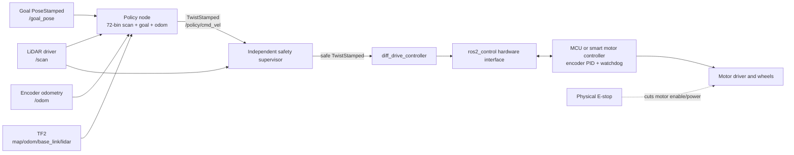

---
aliases:
  - Raspberry Pi ROS 2 deployment guide
  - Physical robot deployment
tags:
  - robotics
  - ros2
  - raspberry-pi
  - lidar
  - sim-to-real
date: 2026-08-18
---

# Physical Robot Deployment — Start Here

This guide turns the trained Isaac Lab actor into a cautious ROS 2 controller for a physical differential-drive
robot. It assumes a Raspberry Pi, a planar 360° LiDAR, wheel encoders, and a motor controller. The exact LiDAR and
motor board may differ; the interfaces and validation process stay the same.

> [!danger] The policy is not a safety system
> Use a physical emergency stop that removes motor power, an independent motor watchdog, conservative speed limits,
> and a software collision monitor. Test with the drive wheels raised before placing the robot on the floor.

## Recommended baseline

| Layer | Recommended starting point |
|---|---|
| Computer | Raspberry Pi 5, 8 GB, active cooling, reliable 5 V supply |
| OS | Ubuntu Server 24.04 LTS, 64-bit ARM |
| ROS | ROS 2 Jazzy LTS |
| Motor loop | Encoder PID and watchdog on a microcontroller or smart motor controller |
| ROS drive | `ros2_control` plus `diff_drive_controller` |
| LiDAR | 360° unit with a maintained ROS 2 Jazzy ARM64 driver publishing `sensor_msgs/LaserScan` |
| Inference | `policy.onnx` with ONNX Runtime CPU, 20 Hz |
| Localization | Wheel odometry first; wheel + IMU EKF next; SLAM/localization only when map goals are needed |
| Software guard | Nav2 Collision Monitor or an equivalent footprint-aware supervisor |

ROS 2 Jazzy has binary support for Ubuntu 24.04 on 64-bit ARM. This is a more predictable deployment base than
mixing Raspberry Pi OS, Conda, and source-built ROS packages. See the official
[ROS 2 Raspberry Pi guide](https://docs.ros.org/en/ros2_documentation/kilted/How-To-Guides/Installing-on-Raspberry-Pi.html)
and [Jazzy Ubuntu installation](https://docs.ros.org/en/jazzy/Installation/Ubuntu-Install-Debs.html).

## System architecture



The Raspberry Pi runs ROS, transforms, inference, logging, and supervisory logic. A microcontroller or smart motor
controller should close the wheel-speed loops and stop the motors if communication is lost. Linux is not the right
place for the only motor watchdog.

## Fixed policy contract

The existing checkpoint accepts exactly 79 `float32` values and produces two normalized actions. Do not change this
layout without retraining.

| Slice | Meaning | Real-robot source |
|---|---|---|
| `0:72` | LiDAR ranges, 5° bins, clipped/divided by 8 m | `/scan`, resampled with minimum valid return per bin |
| `72` | goal distance divided by 8 m | goal transformed into `base_link` |
| `73:75` | `sin(goal_bearing)`, `cos(goal_bearing)` | same transform |
| `75` | measured forward velocity divided by 0.8 m/s | odometry twist, not the command |
| `76` | measured yaw rate divided by 1.5 rad/s | odometry or fused odometry twist |
| `77:79` | previous raw normalized actor output | state held by the policy node |

```text
linear_mps  = 0.4 * (action[0] + 1.0)   # 0.0 ... 0.8 m/s
angular_rps = 1.5 * action[1]            # -1.5 ... 1.5 rad/s
```

The deployment bundle is generated beside the checkpoint:

```text
logs/rsl_rl/diffdrive_lidar_nav/<run>/
├── model_1999.pt
├── exported/policy.onnx
├── exported/policy.pt
└── params/{env.yaml,agent.yaml}
```

Also copy the project-level [policy contract](../../../policy_contract.yaml).

## Read in this order

1. [[01 Hardware Architecture and Wiring]] — power, encoders, motor controller, LiDAR placement, and E-stop.
2. [[02 Raspberry Pi and ROS 2 Setup]] — install Jazzy, create the workspace, and copy the model.
3. [[03 ROS 2 Base, Odometry, and TF]] — make the robot drive correctly without the policy.
4. [[04 LiDAR and the 79-Value Contract]] — reproduce the simulator observation exactly.
5. [[05 ONNX Policy Node]] — run the exported actor at 20 Hz and publish a proposed body command.
6. [[06 Safety, Bringup, and Operations]] — route that command through independent limits and watchdogs.
7. [[07 Calibration and Physical Validation]] — progress from bench tests to controlled autonomous trials.
8. [[08 Troubleshooting and Sim-to-Real Tuning]] — diagnose signs, scaling, latency, clearance, and behavior gaps.

The simulation and training rationale remains in
[[Training a Differential-Drive LiDAR Navigation Policy in Isaac Lab]].

## Topic and frame contract

| Name | Type | Producer | Consumer |
|---|---|---|---|
| `/scan` | `sensor_msgs/msg/LaserScan` | LiDAR driver | policy, collision monitor, SLAM |
| `/wheel/odom` | `nav_msgs/msg/Odometry` | diff-drive controller | EKF or policy during initial bringup |
| `/odometry/filtered` | `nav_msgs/msg/Odometry` | `robot_localization` EKF | policy after IMU integration |
| `/goal_pose` | `geometry_msgs/msg/PoseStamped` | RViz, mission node, or waypoint planner | policy |
| `/policy/cmd_vel` | `geometry_msgs/msg/TwistStamped` | policy | collision monitor |
| `/diff_drive_controller/cmd_vel` | `geometry_msgs/msg/TwistStamped` | collision monitor | drive controller |
| `/tf`, `/tf_static` | transforms | drive, localization, robot state publisher | all spatial consumers |

Required transform tree:

```text
map  ->  odom  ->  base_link  ->  lidar_link
         dynamic    dynamic       static
```

For a first no-map test, publish the goal in `odom` and omit `map -> odom`. Add SLAM Toolbox or AMCL later when goals
come from a map. Nav2's [transform setup guide](https://docs.nav2.org/setup_guides/transformation/setup_transforms.html)
explains ownership of these frames.

## Definition of done

- [ ] E-stop removes motor torque without relying on the Pi.
- [ ] MCU stops both wheels when commands are stale.
- [ ] Equal positive wheel commands move the robot in `base_link` +X.
- [ ] Positive angular command turns counterclockwise.
- [ ] Encoder odometry reports correct distance and yaw within measured tolerance.
- [ ] `/scan` zero angle is forward and angles increase counterclockwise.
- [ ] TF has one publisher for each dynamic transform and no loops.
- [ ] Policy input is exactly shape `(1, 79)`, `float32`, finite, and contract-tested.
- [ ] ONNX output matches a golden desktop inference vector.
- [ ] Policy, controller, and MCU watchdogs all stop the robot independently.
- [ ] Shadow-mode logs pass before the policy is connected to motors.
- [ ] Low-speed physical trials meet predefined collision and clearance criteria.

## Decisions that still require your hardware

Record these before writing a hardware driver:

| Item | Measured value / choice |
|---|---|
| LiDAR model and ROS 2 driver | |
| LiDAR scan rate and serial/USB device | |
| LiDAR position `(x, y, z)` and yaw in `base_link` | |
| Motor voltage, continuous current, and stall current | |
| Motor driver and electrical interface | |
| Encoder counts per **wheel** revolution after gearing | |
| Wheel radius under load | |
| Effective wheel separation | |
| MCU/smart-controller protocol and update rate | |
| Pi supply rating and battery chemistry | |
| E-stop wiring and motor-enable behavior | |

> [!important] Version note
> These instructions were checked on 2026-08-18 against ROS 2 Jazzy and the current Jazzy `ros2_control`
> documentation. Pin package and Python dependency versions on the robot after the first known-good build.

