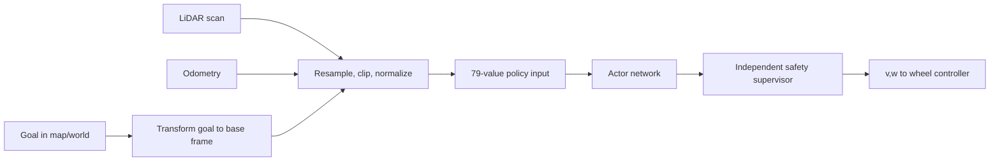

---
aliases:
  - Isaac Lab differential-drive navigation tutorial
tags:
  - robotics
  - reinforcement-learning
  - isaac-lab
  - sim-to-real
  - lidar
date: 2026-08-13
---

# Training a Differential-Drive LiDAR Navigation Policy in Isaac Lab

> [!tip] Ready for the physical robot?
> Continue with [[Physical Robot Deployment - Start Here]] for the Raspberry Pi, ROS 2, LiDAR preprocessing,
> `ros2_control`, ONNX inference, safety, calibration, and staged hardware-validation guide.

This tutorial lays out a practical path from an Isaac Lab PPO experiment to cautious testing on a real differential-drive robot. The policy is a **local point-goal navigator**: it receives a planar LiDAR scan, a goal relative to the robot, measured base velocity, and its previous command; it outputs forward and angular velocity commands while avoiding obstacles.

The most important design decision is to make the neural network's interface independent of the exact wheels and LiDAR. The simulator and real robot must produce the same normalized observation vector and interpret the same two policy outputs, but they do **not** need identical hardware.

> [!important] Scope
> A reactive policy cannot reliably solve every maze from a single local scan. It cannot plan around an obstacle it has never seen or reason about loops. For long-range navigation, let a global planner provide reachable local waypoints and use this policy as the local obstacle-avoidance controller.

This guide follows the manager-based Isaac Lab workflow and RSL-RL PPO. Isaac Lab also has a direct workflow, but the manager-based form keeps observations, actions, rewards, resets, and randomization modular and supports exporting IO descriptors. The APIs shown match the Isaac Lab `main` documentation checked on 2026-08-13. Pin an Isaac Lab release or commit and expect small import/configuration changes on other versions.

## 1. Define the contract before building the environment

Use one policy frequency and one exact tensor layout in simulation and on the robot. A good first contract is:

| Term | Size | Definition |
|---|---:|---|
| LiDAR | 72 | 360° scan in 5° bins, nearest range per bin, clipped to 8 m, divided by 8 m |
| Goal | 3 | distance divided by 8 m, `sin(bearing)`, `cos(bearing)` |
| Base velocity | 2 | measured forward speed divided by 0.8 m/s, yaw rate divided by 1.5 rad/s |
| Previous action | 2 | previous normalized policy output |
| **Total** | **79** | fixed order, `float32` |

The action is:

```text
a = [a_v, a_w] in [-1, 1]^2
v_cmd = 0.8 * (a_v + 1) / 2       # 0.0 ... 0.8 m/s
w_cmd = 1.5 * a_w                 # -1.5 ... 1.5 rad/s
```

This forward-only mapping is easy to learn and safer for a first robot test. Later, allow a small reverse range, such as `[-0.2, 0.8] m/s`, if cul-de-sacs matter.

For a simulated or real robot with wheel radius `r` and wheel separation `L`, the low-level drive converts the body command to wheel angular speeds:

```text
omega_left  = (v_cmd - 0.5 * L * w_cmd) / r
omega_right = (v_cmd + 0.5 * L * w_cmd) / r
```

Keep that conversion **outside the policy**. A different real wheel radius or track width then changes only the drive adapter.



Write this contract into a small machine-readable file beside the exported model. Record the term order, units, normalization constants, LiDAR angle convention, control rate, action mapping, goal tolerance, and model checksum. Treat any change to that file as an interface change requiring revalidation.

## 2. Measure both robots

Before training, make a table for the simulated nominal robot and the intended real robot:

- wheel radius, wheel separation, footprint, ground clearance, mass, and center of mass;
- maximum wheel speed, acceleration, braking behavior, motor dead zone, and command latency;
- LiDAR height, position, yaw, field of view, angular resolution, range limits, scan rate, and invalid-return convention;
- odometry/localization update rate, drift, and latency;
- controller rate and whether it accepts body twist or wheel velocity.

Measure rather than copy brochure values. Run low-speed forward and turning steps on the real platform, log commands and odometry, and estimate delay, steady-state gain, acceleration, saturation, and left/right bias. The training randomization ranges should contain the measured real values—not merely be “wide.”

## 3. Create an external Isaac Lab project

Install a pinned Isaac Lab version following the [official installation and quickstart guide](https://isaac-sim.github.io/IsaacLab/main/source/setup/quickstart.html). From the Isaac Lab repository:

```bash
./isaaclab.sh --new
```

Choose:

- **External project**
- **Manager-based** environment
- **RSL-RL / PPO**

Then install the generated package:

```bash
cd /path/to/diffdrive_nav
uv pip install -e source/diffdrive_nav
```

The generator and editable-install process are described in the [official project template quickstart](https://isaac-sim.github.io/IsaacLab/main/source/setup/quickstart.html#generate-your-own-project). A useful task layout is:

```text
source/diffdrive_nav/diffdrive_nav/tasks/navigation/
├── __init__.py
├── navigation_env_cfg.py
├── agents/
│   └── rsl_rl_ppo_cfg.py
└── mdp/
    ├── __init__.py
    ├── actions.py
    ├── observations.py
    ├── rewards.py
    ├── terminations.py
    └── events.py
```

Register the task in `navigation/__init__.py`. Keep the names generated by your installed template if they differ:

```python
import gymnasium as gym

from . import agents

gym.register(
    id="Isaac-DiffDrive-Lidar-Nav",
    entry_point="isaaclab.envs:ManagerBasedRLEnv",
    disable_env_checker=True,
    kwargs={
        "env_cfg_entry_point": f"{__name__}.navigation_env_cfg:DiffDriveNavEnvCfg",
        "rsl_rl_cfg_entry_point": (
            f"{agents.__name__}.rsl_rl_ppo_cfg:DiffDrivePPORunnerCfg"
        ),
    },
)
```

Isaac Lab's [environment-registration tutorial](https://isaac-sim.github.io/IsaacLab/main/source/tutorials/03_envs/register_rl_env_gym.html) explains why importing the package is required before Gymnasium can find the task.

## 4. Import and validate the robot

Import the robot's URDF into Isaac Sim and save a USD asset, or point an `ArticulationCfg` at an existing USD. The robot needs:

- one valid articulation root;
- continuous or revolute left/right wheel joints with correct axes;
- collision shapes on the chassis, wheels, and caster;
- realistic mass and inertia;
- velocity drives with realistic effort and speed limits;
- no accidental fixed base;
- a stable base frame whose +X axis is forward and +Z is up.

Create an asset configuration along these lines, replacing every path and joint expression with the names in your USD:

```python
import isaaclab.sim as sim_utils
from isaaclab.actuators import ImplicitActuatorCfg
from isaaclab.assets import ArticulationCfg

ROBOT_CFG = ArticulationCfg(
    prim_path="{ENV_REGEX_NS}/Robot",
    spawn=sim_utils.UsdFileCfg(
        usd_path="/absolute/path/to/diffdrive.usd",
        activate_contact_sensors=True,
        rigid_props=sim_utils.RigidBodyPropertiesCfg(
            disable_gravity=False,
            max_depenetration_velocity=1.0,
        ),
        articulation_props=sim_utils.ArticulationRootPropertiesCfg(
            enabled_self_collisions=False,
            solver_position_iteration_count=8,
            solver_velocity_iteration_count=2,
        ),
    ),
    init_state=ArticulationCfg.InitialStateCfg(
        pos=(0.0, 0.0, 0.08),
        joint_pos={".*wheel.*": 0.0},
        joint_vel={".*wheel.*": 0.0},
    ),
    actuators={
        "wheels": ImplicitActuatorCfg(
            joint_names_expr=["left_wheel_joint", "right_wheel_joint"],
            effort_limit_sim=8.0,
            velocity_limit_sim=20.0,
            stiffness=0.0,
            damping=2.0,
        )
    },
)
```

Those numeric values are placeholders, not universal tuning values. Follow the official [Adding a New Robot](https://isaac-sim.github.io/IsaacLab/main/source/tutorials/01_assets/add_new_robot.html) guide, then validate the articulation with a simple script before introducing RL:

1. command equal wheel speeds and verify straight motion;
2. command opposite wheel speeds and verify rotation about the expected point;
3. measure simulated step responses and compare them with the real logs;
4. inspect collisions, wheel slip, joint ordering, limits, and coordinate signs;
5. confirm the robot remains stable for several minutes at rest.

If this test is wrong, PPO will learn around a broken model and produce a policy that is hard to interpret or transfer.

## 5. Build the arena and LiDAR

Start with 6–10 m square arenas containing walls, boxes, cylinders, and gaps wider than the footprint plus a safety margin. Reject any reset in which the start or goal overlaps an obstacle or no collision-free path exists. A cheap 2-D occupancy-grid flood fill during arena generation is enough to reject impossible episodes.

Use many parallel environments. Each environment should vary:

- start pose and goal;
- obstacle count, size, pose, and layout;
- corridor width and obstacle clearance;
- floor friction and robot dynamics;
- sensor noise and delay.

For a fixed arena, a single merged static mesh is fast. For obstacles moved on reset, current Isaac Lab provides `MultiMeshRayCasterCfg`, whose tracked targets can follow dynamic mesh transforms. The [multi-mesh ray-caster configuration](https://isaac-sim.github.io/IsaacLab/main/_modules/isaaclab/sensors/ray_caster/multi_mesh_ray_caster_cfg.html) documents `track_mesh_transforms`; older releases may require fixed arena variants or an RTX LiDAR instead.

A representative scene fragment is:

```python
from isaaclab.scene import InteractiveSceneCfg
from isaaclab.sensors import ContactSensorCfg, MultiMeshRayCasterCfg
from isaaclab.sensors.ray_caster import patterns
from isaaclab.utils import configclass

@configclass
class NavigationSceneCfg(InteractiveSceneCfg):
    robot = ROBOT_CFG

    # Define ground, walls, and obstacle assets here. Give all obstacle
    # containers a predictable path such as {ENV_REGEX_NS}/Obstacles/box_0.

    lidar = MultiMeshRayCasterCfg(
        prim_path="{ENV_REGEX_NS}/Robot/base_link",
        update_period=0.05,  # 20 Hz
        offset=MultiMeshRayCasterCfg.OffsetCfg(pos=(0.10, 0.0, 0.20)),
        ray_alignment="yaw",
        max_distance=8.0,
        pattern_cfg=patterns.LidarPatternCfg(
            channels=1,
            vertical_fov_range=(0.0, 0.0),
            horizontal_fov_range=(-180.0, 180.0),
            horizontal_res=5.0,
        ),
        mesh_prim_paths=[
            MultiMeshRayCasterCfg.RaycastTargetCfg(
                prim_expr="{ENV_REGEX_NS}/Arena",
                track_mesh_transforms=True,
            )
        ],
        debug_vis=False,
    )

    chassis_contact = ContactSensorCfg(
        prim_path="{ENV_REGEX_NS}/Robot/base_link",
        history_length=3,
        track_air_time=False,
    )
```

Make the ray-cast geometry match collision geometry closely. A policy that “sees” a visual mesh but collides with a larger invisible approximation will learn unsafe clearance.

## 6. Implement the exact observations

The ray caster exposes hit positions in world coordinates, so ranges are the norm of each hit minus the sensor origin. Current development builds may expose sensor arrays through a `.torch` accessor; released builds may already return a tensor. The [RayCasterData reference](https://isaac-sim.github.io/IsaacLab/main/_modules/isaaclab/sensors/ray_caster/ray_caster_data.html) defines the `(num_envs, num_rays, 3)` hit layout.

```python
import torch
from isaaclab.managers import SceneEntityCfg

LIDAR_MAX = 8.0

def _torch_view(value):
    return value.torch if hasattr(value, "torch") else value

def lidar_ranges(env, sensor_cfg=SceneEntityCfg("lidar")) -> torch.Tensor:
    sensor = env.scene.sensors[sensor_cfg.name]
    hits_w = _torch_view(sensor.data.ray_hits_w)
    origin_w = _torch_view(sensor.data.pos_w)[:, None, :]
    ranges = torch.linalg.vector_norm(hits_w - origin_w, dim=-1)
    ranges = torch.nan_to_num(ranges, nan=LIDAR_MAX, posinf=LIDAR_MAX)
    return ranges.clamp(0.0, LIDAR_MAX) / LIDAR_MAX

def goal_polar(env, command_name="goal") -> torch.Tensor:
    # UniformPose2dCommand supplies target position in the robot/base frame.
    goal_b = env.command_manager.get_command(command_name)[:, :2]
    distance = torch.linalg.vector_norm(goal_b, dim=-1).clamp_max(8.0)
    bearing = torch.atan2(goal_b[:, 1], goal_b[:, 0])
    return torch.stack((distance / 8.0, torch.sin(bearing), torch.cos(bearing)), dim=-1)

def base_velocity(env, asset_cfg=SceneEntityCfg("robot")) -> torch.Tensor:
    robot = env.scene[asset_cfg.name]
    return torch.stack(
        (robot.data.root_lin_vel_b[:, 0] / 0.8,
         robot.data.root_ang_vel_b[:, 2] / 1.5),
        dim=-1,
    ).clamp(-2.0, 2.0)
```

Configure the policy group in this exact order:

```python
from isaaclab.envs import mdp
from isaaclab.managers import ObservationGroupCfg as ObsGroup
from isaaclab.managers import ObservationTermCfg as ObsTerm
from isaaclab.utils import configclass
from isaaclab.utils.noise import AdditiveUniformNoiseCfg

@configclass
class ObservationsCfg:
    @configclass
    class PolicyCfg(ObsGroup):
        scan = ObsTerm(
            func=lidar_ranges,
            noise=AdditiveUniformNoiseCfg(n_min=-0.01, n_max=0.01),
        )
        goal = ObsTerm(func=goal_polar)
        velocity = ObsTerm(func=base_velocity)
        previous_action = ObsTerm(func=mdp.last_action)

        def __post_init__(self):
            self.enable_corruption = True
            self.concatenate_terms = True

    policy: PolicyCfg = PolicyCfg()
```

Do not feed actor observations that cannot be reproduced on the real robot. Simulator ground-truth position may be used to generate the training goal vector, because the real localization stack can generate the corresponding vector, but actor input should be the noisy relative goal—not pristine world pose. A critic may use privileged simulation state if the chosen PPO implementation supports asymmetric actor/critic observations, but only the actor is deployed.

### Real LiDAR resampling

Do not select every *N*th beam and assume it matches the simulator. For every desired 5° output bin:

1. transform the real scan angle into the same +X-forward, counterclockwise-positive convention;
2. take the minimum valid range in that angular bin;
3. map `NaN`, `Inf`, below-minimum, and no-return values according to a documented rule;
4. clip to `[0, 8]` and divide by 8;
5. account for the real LiDAR-to-base extrinsic transform.

Taking the minimum preserves thin nearby obstacles better than an average. Unit-test this preprocessor with recorded scans before running the model.

## 7. Generate goals and resets

Isaac Lab provides `UniformPose2dCommandCfg` for 2-D goal commands. Its current API can also log success when `position_success_threshold` is set. See the [command API reference](https://isaac-sim.github.io/IsaacLab/develop/source/api/lab/isaaclab.envs.mdp.html#commands).

```python
import math
from isaaclab.envs import mdp
from isaaclab.utils import configclass

@configclass
class CommandsCfg:
    goal = mdp.UniformPose2dCommandCfg(
        asset_name="robot",
        resampling_time_range=(math.inf, math.inf),
        simple_heading=True,
        position_success_threshold=0.30,
        debug_vis=True,
        ranges=mdp.UniformPose2dCommandCfg.Ranges(
            pos_x=(-4.0, 4.0),
            pos_y=(-4.0, 4.0),
            heading=(-math.pi, math.pi),
        ),
    )
```

Uniform coordinate sampling alone is insufficient in clutter. Add a reset event or custom command term that samples free cells, enforces a minimum start-goal distance, and rejects disconnected pairs. Reset wheel velocity and the robot root state, clear any stateful previous-distance reward, then move obstacles before the first sensor update.

## 8. Map body actions to wheel targets

The simplest first smoke test is Isaac Lab's built-in `JointVelocityActionCfg` with two wheel actions. For transfer, however, use a small custom `ActionTerm` that accepts `[a_v, a_w]`, maps it to body velocity, converts it with the **simulated** `r` and `L`, and calls the articulation's joint-velocity target method. Follow the abstract `ActionTerm` lifecycle: `process_actions()` runs once per policy step and `apply_actions()` runs every physics substep. The [ActionManager source](https://isaac-sim.github.io/IsaacLab/main/_modules/isaaclab/managers/action_manager.html) documents that split.

The core calculation is:

```python
def process_actions(self, actions: torch.Tensor):
    self._raw_actions[:] = actions.clamp(-1.0, 1.0)
    v = 0.4 * (self._raw_actions[:, 0] + 1.0)  # [0, 0.8]
    w = 1.5 * self._raw_actions[:, 1]
    self._wheel_targets[:, 0] = (v - 0.5 * self.cfg.track_width * w) / self.cfg.wheel_radius
    self._wheel_targets[:, 1] = (v + 0.5 * self.cfg.track_width * w) / self.cfg.wheel_radius

def apply_actions(self):
    self._asset.set_joint_velocity_target(
        self._wheel_targets,
        joint_ids=self._wheel_joint_ids,
    )
```

The complete class must also resolve wheel joint IDs, preserve `[left, right]` order, allocate tensors on `env.device`, expose `action_dim = 2`, retain raw/processed actions, and define a matching `ActionTermCfg`. Copy the structure of a current built-in action term from your pinned checkout rather than copying an action class from a different release.

Add acceleration limiting either inside this term or as actuator lag:

```text
v_applied[k] = clamp(v_cmd[k], v_applied[k-1] ± a_v_max * dt_policy)
w_applied[k] = clamp(w_cmd[k], w_applied[k-1] ± a_w_max * dt_policy)
```

Use the same limits in the hardware adapter. Randomize them during training.

## 9. Design rewards that cannot be easily exploited

Let `d_t` be goal distance, `c_t` minimum LiDAR clearance, `a_t` the normalized action, and `dt` the policy period. A sound starting reward per step is:

```text
r_t =  4.0 * (d_(t-1) - d_t)              progress
     + 0.05                                alive, only while not failed
     - 0.10 * ||a_t - a_(t-1)||²           smoothness
     - 0.05 * |w_cmd|                      unnecessary spinning
     - 0.50 * max(0, (0.35 - c_t)/0.35)²  near-obstacle cost
     + 20.0 * reached_goal
     - 20.0 * collision
```

Use the actual collision/contact sensor for the collision penalty; do not infer collision solely from LiDAR. Keep success and collision terminal. End an episode on:

- goal distance below 0.30 m, optionally held for 0.25–0.5 s;
- chassis/obstacle contact above a small impulse threshold;
- leaving the arena or tipping;
- timeout, initially 20–30 s.

Reward terms should return one tensor value per environment. Progress needs reset-aware state (`d_(t-1)`); implement it as a stateful manager term or reset its buffer in an event. Do not accidentally reward progress across an episode reset.

Watch for common reward exploits:

- a large alive reward makes the robot loiter;
- a large forward-speed reward makes it ram obstacles;
- a heading-only reward makes it spin toward a goal behind a wall;
- a huge clearance cost makes it freeze;
- terminating on collision without a terminal penalty can make crashing cheaper than a long timeout.

Plot every reward component separately and inspect video, not just total return.

## 10. Assemble the environment timing

A useful initial timing configuration is:

```python
from isaaclab.envs import ManagerBasedRLEnvCfg
from isaaclab.sim import SimulationCfg
from isaaclab.utils import configclass

@configclass
class DiffDriveNavEnvCfg(ManagerBasedRLEnvCfg):
    scene: NavigationSceneCfg = NavigationSceneCfg(
        num_envs=1024,
        env_spacing=12.0,
        replicate_physics=True,
    )
    observations: ObservationsCfg = ObservationsCfg()
    actions: ActionsCfg = ActionsCfg()
    commands: CommandsCfg = CommandsCfg()
    rewards: RewardsCfg = RewardsCfg()
    terminations: TerminationsCfg = TerminationsCfg()
    events: EventCfg = EventCfg()
    curriculum: CurriculumCfg = CurriculumCfg()

    def __post_init__(self):
        self.decimation = 6
        self.episode_length_s = 25.0
        self.sim = SimulationCfg(dt=1.0 / 120.0, render_interval=self.decimation)
```

This gives 120 Hz physics and 20 Hz policy inference. Match the eventual hardware policy rate. If the physical LiDAR is 10 Hz, either train the policy at 10 Hz or deliberately hold each scan for two 20 Hz policy steps and randomize its age. The simulator should reproduce stale data rather than silently delivering perfect fresh scans.

## 11. Add sim-to-real randomization

Randomize one physically plausible model per episode, then keep most parameters fixed during that episode. Start narrow and expand after the task learns.

| Category | Suggested initial range |
|---|---|
| wheel radius and track | measured nominal ±3–8% |
| mass and center of mass | measured uncertainty/payload range |
| wheel-floor friction | cover every intended floor surface |
| motor response | gain, left/right bias, time constant, dead zone, saturation |
| action delay | 0–2 policy frames initially |
| LiDAR range | noise, bias, occasional dropped beams, invalid returns |
| LiDAR geometry | small yaw/position extrinsic error and angular offset |
| localization | position/yaw noise, drift, and delayed goal transform |
| environment | obstacle shape/size/pose, corridor width, floor friction |

Isaac Lab's event manager includes rigid-body material, mass, joint, and actuator randomization; the [official domain-randomization migration example](https://isaac-sim.github.io/IsaacLab/main/source/migration/migrating_from_omniisaacgymenvs.html#domain-randomization) shows `EventTermCfg` usage. Custom events or your custom drive action can randomize properties not directly covered, such as effective wheel radius, track width, command FIFO delay, and motor dead zone.

Do not use randomization to conceal a badly identified nominal model. First match average straight-line speed, yaw response, stopping distance, and latency. Then randomize around the uncertainty.

## 12. Use a curriculum

Train in stages so PPO first discovers that moving toward the goal is useful:

1. **Empty arena:** close goals, no obstacles, low speed.
2. **Sparse obstacles:** large clearances and no narrow gaps.
3. **Dense static clutter:** full goal range and varied layouts.
4. **Dynamics and sensor gap:** increase friction, actuator, latency, LiDAR, and localization randomization.
5. **Hard cases:** narrow—but physically passable—gaps, cul-de-sacs, partial scans, and moving obstacles if required.

Advance based on held-out success and collision rate, not training iteration alone. Preserve a fraction of easy environments so the policy does not forget basic goal seeking.

## 13. Configure and train PPO

For the 79-value vector observation, begin with an MLP actor/critic such as `[256, 256, 128]` with ELU activations. A typical RSL-RL starting point is:

- 24–32 rollout steps per environment;
- discount `gamma = 0.99`;
- GAE `lambda = 0.95`;
- PPO clip `0.2`;
- entropy coefficient around `0.005–0.01`, decayed if needed;
- learning rate around `3e-4` with the framework's adaptive schedule;
- 5 learning epochs and 4 mini-batches;
- empirical observation normalization enabled if it is exported with the actor.

Use the configuration class generated for your pinned RSL-RL version. First run one environment with the UI and random actions. Then run 32 environments for a few iterations. Only scale up after shapes, resets, contacts, ray hits, reward terms, and memory usage are correct.

Current unified CLI:

```bash
uv run isaaclab train \
  --rl_library rsl_rl \
  --task Isaac-DiffDrive-Lidar-Nav \
  --num_envs 1024 \
  --headless \
  --export_io_descriptors \
  --run_name baseline
```

The wrapper form used by older releases is typically:

```bash
./isaaclab.sh -p scripts/reinforcement_learning/rsl_rl/train.py \
  --task Isaac-DiffDrive-Lidar-Nav \
  --num_envs 1024 \
  --headless \
  --export_io_descriptors \
  --run_name baseline
```

Use the command supported by the pinned checkout. Isaac Lab's [RL training tutorial](https://isaac-sim.github.io/IsaacLab/main/source/tutorials/03_envs/run_rl_training.html) covers headless training, video, TensorBoard, and playback.

Monitor at least:

- success, collision, timeout, and out-of-bounds rates;
- episode time and path length;
- minimum clearance;
- each reward component;
- action mean, variance, rate, and saturation;
- performance by arena difficulty and randomization value.

Run several random seeds. A single lucky training curve is not a result.

## 14. Evaluate before export

Create a separate play/evaluation configuration with deterministic actions and no curriculum. Do not simply turn off all randomization; evaluate a matrix:

1. nominal simulator;
2. held-out arena layouts and seeds;
3. edge values for friction, radius, track, mass, delay, and sensor noise;
4. combined randomization draws;
5. sensor faults such as stale scans and dropped sectors;
6. altered robot geometry representing the real platform.

Use at least thousands of held-out episodes and report:

- success rate;
- collision rate separately from timeout rate;
- time and path length conditional on success;
- path efficiency or SPL;
- minimum obstacle clearance;
- action saturation and emergency-supervisor intervention rate.

Also test adversarial cases manually: goal behind the robot, wall directly ahead, narrow doorway, concave corner, glass-like/no-return scan sector, localization jump, blocked goal, and loss of LiDAR messages.

Play a checkpoint with the same task and observation settings used for training:

```bash
uv run isaaclab play \
  --rl_library rsl_rl \
  --task Isaac-DiffDrive-Lidar-Nav \
  --num_envs 32 \
  --checkpoint /absolute/path/to/model.pt
```

Changing observation order, bin count, preset, or normalization between train and play invalidates the checkpoint even when tensor dimensions happen to match.

## 15. Export the policy and its interface

RSL-RL playback normally exports TorchScript/JIT and ONNX artifacts beside the checkpoint. Isaac Lab also exposes `export_policy_as_onnx`; see the [official RSL-RL exporter](https://isaac-sim.github.io/IsaacLab/main/_modules/isaaclab_rl/rsl_rl/exporter.html). Export IO descriptors while training or with:

```bash
uv run python scripts/environments/export_io_descriptors.py \
  --task Isaac-DiffDrive-Lidar-Nav \
  --output_dir ./io_descriptors
```

IO descriptors preserve observation/action term order and environment timing for manager-based tasks. The [IO Descriptors tutorial](https://isaac-sim.github.io/IsaacLab/develop/source/policy_deployment/01_io_descriptors/io_descriptors_101.html) explains their contents.

Package together:

```text
deployment_bundle/
├── policy.onnx
├── io_descriptors.yaml
├── policy_contract.yaml
├── training_env.yaml
├── agent.yaml
├── validation_results.json
└── SHA256SUMS
```

Before touching hardware, replay a fixed batch of saved observation vectors through both the Isaac Lab policy and the deployment runtime. Assert that actions match within a small numerical tolerance. This catches missing normalizers, wrong input order, dtype errors, and export problems.

## 16. Build the real-robot inference node

The deployment node should run the **same pure preprocessing function** used in evaluation. A ROS 2-style control loop is conceptually:

```python
def control_tick():
    scan = newest_scan_or_none()
    pose = newest_localized_pose_or_none()
    odom = newest_odometry_or_none()

    if scan_is_stale(scan, 0.20) or pose_is_stale(pose, 0.20) or odom_is_stale(odom, 0.20):
        publish_stop()
        return

    goal_b = transform_goal_to_base(goal_map, pose)
    scan72 = resample_min_ranges(scan, bins=72, max_range=8.0)
    obs = pack_float32_observation(
        lidar=scan72 / 8.0,
        goal=[clip(norm(goal_b) / 8.0, 0, 1), sin(bearing(goal_b)), cos(bearing(goal_b))],
        velocity=[clip(odom.vx / 0.8, -2, 2), clip(odom.wz / 1.5, -2, 2)],
        previous_action=previous_action,
    )

    action = onnx_session.run(None, {input_name: obs[None, :]})[0][0]
    v, w = decode_action(action)
    v_safe, w_safe = safety_supervisor(scan, v, w)
    publish_twist(v_safe, w_safe)
```

In ROS REP-103-style planar frames, +X forward, +Y left, and positive yaw counterclockwise align naturally with the proposed policy convention. Verify signs experimentally. For world/map delta `(dx, dy)` and robot yaw `psi`, the base-frame goal is:

```text
x_b =  cos(psi) * dx + sin(psi) * dy
y_b = -sin(psi) * dx + cos(psi) * dy
```

Do not use wheel command as the velocity observation; use measured odometry, matching the simulator's measured base velocity.

## 17. Put a safety supervisor outside the network

The learned policy is not a safety system. The robot process should independently enforce:

- physical emergency stop and accessible remote stop;
- command heartbeat/watchdog that stops on stale inference;
- LiDAR, localization, and odometry freshness checks;
- hard linear/angular speed and acceleration limits;
- a footprint-aware protective zone, not just the single closest ray;
- braking-distance limiting based on measured stopping behavior;
- bumper/contact stop if available;
- geofence and test-area boundary;
- automatic stop on inference exception, non-finite tensor, or invalid scan;
- command logging with synchronized scan, pose, odometry, action, and supervisor reason.

A simple forward braking guard can cap speed based on free distance `d_free`:

```text
v_safe <= sqrt(2 * a_brake * max(0, d_free - margin))
```

Use a conservative measured braking deceleration and include total sensing, inference, communications, and actuator delay in the margin. A full footprint collision check is better than a front-ray threshold.

## 18. Stage real-world testing

Use this order, with a human holding the e-stop:

1. **Offline:** run the exported model on recorded LiDAR/goal/odometry bags; publish nothing.
2. **Shadow mode:** run live inference and log proposed commands while a conventional controller or teleoperator drives.
3. **Wheels raised:** verify signs, scaling, watchdog, and stopping.
4. **Open floor:** cap speed to roughly 10–20% of the final limit; test goals with no obstacles.
5. **One soft obstacle:** approach from several angles and confirm the independent guard intervenes.
6. **Sparse controlled course:** compare logs against corresponding simulation episodes.
7. **Denser course:** increase speed only after quantitative pass criteria are met.

Predefine go/no-go criteria, for example zero contact in 100 low-speed controlled trials, no stale-command motion, and a minimum observed clearance above the chosen safety margin. Any systematic discrepancy—turn bias, oscillation, late braking, missing thin objects, localization jumps—should lead back to system identification, simulation, and retraining rather than an ad hoc output multiplier on the robot.

## 19. Common failure modes

| Symptom | Likely cause | First check |
|---|---|---|
| Spins forever | goal bearing sign/order error or spin reward exploit | feed synthetic goals at left/right/front |
| Drives through obstacles in sim | ray caster is not targeting collision meshes | visualize rays and compare target prim paths |
| Freezes near every obstacle | clearance penalty too large or curriculum too hard | evaluate reward components in sparse arenas |
| Works in sim, oscillates on robot | unmodeled delay, rate mismatch, or missing previous action | replay with measured command delay |
| Always curves on robot | left/right gain, radius, or wheel-order mismatch | low-speed straight step test |
| Clips door frames | footprint absent from reward/guard or geometry mismatch | dilate obstacles by footprint radius |
| ONNX output differs | missing observation normalizer or term-order mismatch | golden-vector parity test |
| Great reward, poor success | reward hacking or success metric not terminal | inspect videos and terminal counters |
| Cannot solve U-shaped obstacles | local reactive observation is insufficient | add global waypoints, history, or a local map |

## 20. Recommended implementation order

- [ ] Pin Isaac Lab/Isaac Sim/RSL-RL versions and save the commit hashes.
- [ ] Write `policy_contract.yaml` and tests for tensor order and scaling.
- [ ] Validate robot articulation and wheel kinematics without RL.
- [ ] Validate LiDAR ranges against known obstacle distances.
- [ ] Implement collision, success, timeout, and reset tests.
- [ ] Overfit a tiny empty-arena task.
- [ ] Add obstacles and a curriculum.
- [ ] Match real step-response, delay, and sensor behavior.
- [ ] Add bounded domain randomization.
- [ ] Run held-out evaluation and fault sweeps.
- [ ] Export model, IO descriptors, configs, hashes, and golden vectors.
- [ ] Implement the independent hardware safety supervisor.
- [ ] Follow staged real-world testing with logged pass criteria.

## Official references

- [Isaac Lab quickstart and project generator](https://isaac-sim.github.io/IsaacLab/main/source/setup/quickstart.html)
- [Manager-based RL environment concepts](https://isaac-sim.github.io/IsaacLab/develop/source/api/lab/isaaclab.envs.html)
- [Creating and registering a manager-based environment](https://isaac-sim.github.io/IsaacLab/main/source/tutorials/03_envs/register_rl_env_gym.html)
- [Ray caster overview](https://isaac-sim.github.io/IsaacLab/main/source/overview/core-concepts/sensors/ray_caster.html)
- [Training with an RL agent](https://isaac-sim.github.io/IsaacLab/main/source/tutorials/03_envs/run_rl_training.html)
- [RSL-RL policy exporter](https://isaac-sim.github.io/IsaacLab/main/_modules/isaaclab_rl/rsl_rl/exporter.html)
- [IO descriptors](https://isaac-sim.github.io/IsaacLab/develop/source/policy_deployment/01_io_descriptors/io_descriptors_101.html)
- [Isaac Lab sim-to-real deployment guide](https://isaac-sim.github.io/IsaacLab/main/source/policy_deployment/index.html)
